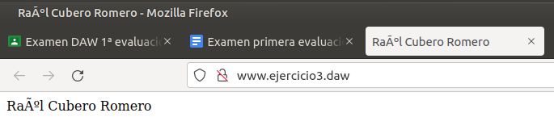

# **Ejercicio 3 EXAMEN**

[Raúl Cubero Romero](https://github.com/raulcr2001)

## **Resumen**

En este ejercicio realizaré un virtualhost a [www.ejercicio3.daw](www.ejercicio3.daw) usando Apache y mostraré en esa web un texto que contendrá mi nombre.

## **Índice**

- [Introducción](#introducción)
- [Virtualhost Paso a Paso](#virtualhost-paso-a-paso)

## **Introducción**

[Apache](https://dinahosting.com/ayuda/que-es-apache-y-para-que-sirve/) es un servidor web [HTTP](https://es.wikipedia.org/wiki/Protocolo_de_transferencia_de_hipertexto) de código abierto creado en 1996 y actualmente es el servidor web más usado en todo el mundo debido a sus seguridad y estabilidad que está desarrollado y mantenido por una comunidad de usuarios en torno a la [Apache Software Foundation](https://httpd.apache.org/docs/2.4/es/).

## **Virtualhost Paso a Paso**

En primer lugar, si no sabemos nuestra IP, una manera de consultarla y además comprobar que nuestro servidor funciona bien es realizando el siguiente comando, que nos **devuelve la IP** y la **ingresamos en el navegador para comprobarlo**.

Paramos el ***servidor Apache*** y a continuación creamos el index.html en ***/var/www/gci***, en este fichero, escribiremos nuestro nombre, el cual se mostrará cuando introduzcamos la url correspondiente.

El siguiente paso será entrar en el siguiente directorio y realizar una copia del fichero ***000-default.conf***.

Cuando lo hayamos copiado, hacemos un **_nano_** del archivo para poder verlo y poder realizar todos los cambios que haya que hacer.

Cambiamos el ***DocumentRoot*** a la ruta donde se encuentra nuestro archivo, y en ***ServerName*** escribimos el que nos dice en el enunciado del ejercicio.

A continuación, iniciamos el servidor, activamos el fichero de configuración y reiniciamos el servidor para guardar los cambios.

Con el siguiente comando, visualizaremos el fichero hosts para poder modificarlo con nuestra dirección IP y la URL deseada.

Escribimos el ***ServerName*** en nuestro navegador y confirmamos que va todo perfectamente, ya hemos acabado el ejercicio.

