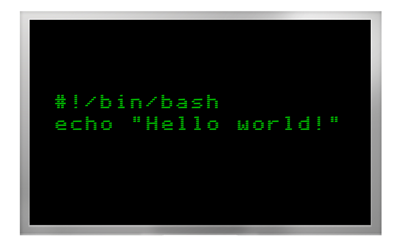
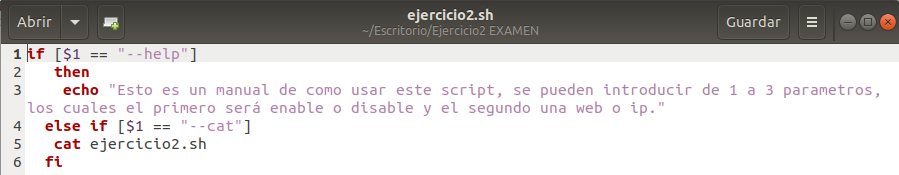

# **Ejercicio 2 EXAMEN**

[Raúl Cubero Romero](https://github.com/raulcr2001)

## **Resumen**

En este ejercicio realizaré un script en el que si introduces el ***nombre + help*** te mostrará un manual de cómo utilizarlo, en cambio, si escribes ***nombre + cat*** te mostrará el contenido del script.

## **Índice**

- [Introducción](#introducción)
- [Help y Cat](#script-de-help-y-cat)
- [Conclusión](#conclusión)

## **Introducción**

[Bash Scripting](https://es.wikipedia.org/wiki/Bash) es un intérprete de comandos que va corriendo una a una las órdenes introducidas por nosotros, otra alternativa es usar un script que contiene todas las instrucciones.

## **Script de Help y Cat**

El siguiente código sirve para que cuando el usuario introduzca el nombre del script junto a una de las dos instrucciones (**help** o **cat**), le muestre un manual del script o si elige la segunda opción le mostrará el contenido del mismo.

## **Conclusión**

En este ejercicio he aprendido a cómo realizar un manual de un script correctamente y a listar el contenido de éste.